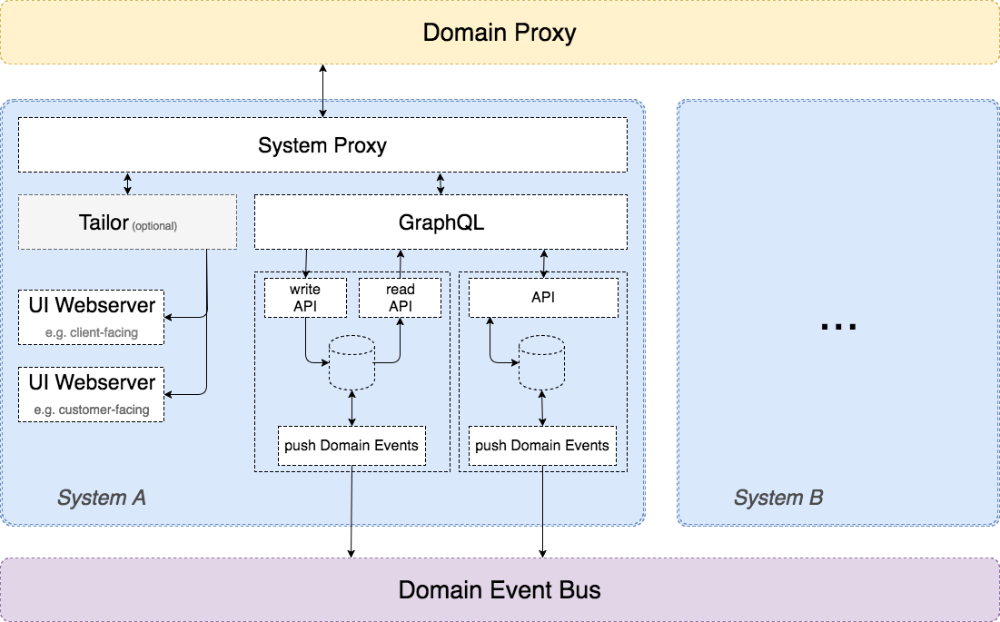
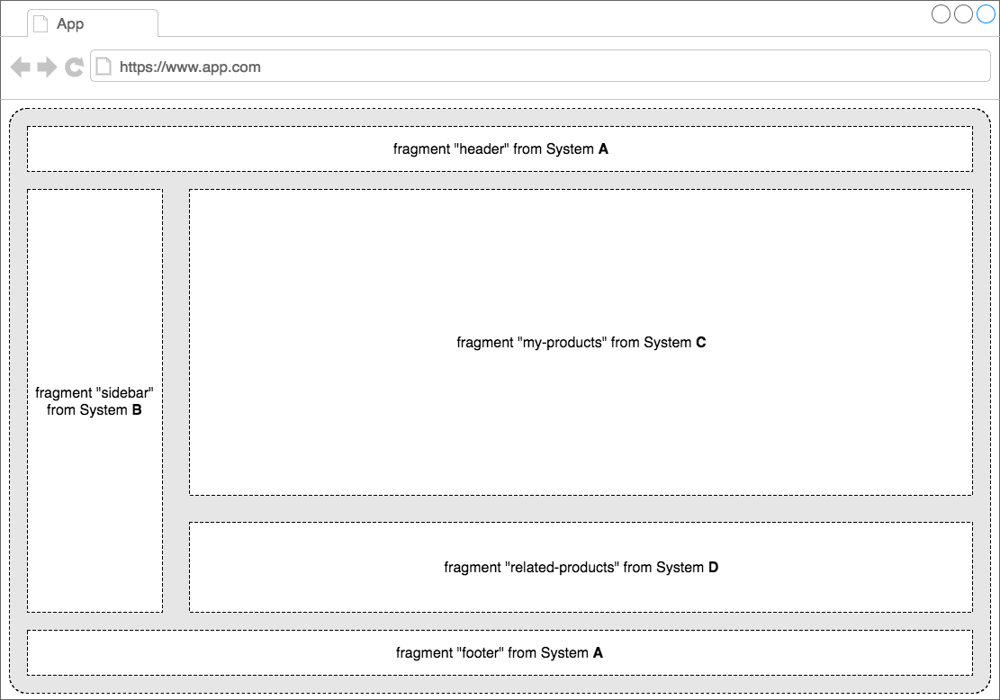

# Architectural outline

To handle the complexity of an overall architecture, similar to city planning, we want to look at it from different levels of abstraction, starting at a high level and then moving into details.

The main goal of the outline is to **regulate the use, form, design and compatibility of development**.

This is a living document as we will update and supplement it continously.

<!-- START doctoc generated TOC please keep comment here to allow auto update -->
<!-- DON'T EDIT THIS SECTION, INSTEAD RE-RUN doctoc TO UPDATE -->
# Table of Contents

- [Changelog](#changelog)
- [Prolog](#prolog)
    - [Domain](#domain)
    - [System](#system)
    - [Bounded Context](#bounded-context)
    - [Principles](#principles)
- [Macro-Architecture](#macro-architecture)
    - [Common Rules and Guidelines](#common-rules-and-guidelines)
        - [Programming Languages / Main Framework](#programming-languages-main-framework)
        - [Frontend Framework](#frontend-framework)
        - [Shared Code](#shared-code)
        - [Databases](#databases)
        - [Separation of systems](#separation-of-systems)
        - [Stay asynchronous](#stay-asynchronous)
    - [Domain Events](#domain-events)
        - [Scheme](#scheme)
            - [Documentation & Validation](#documentation-&-validation)
            - [Envelope](#envelope)
        - [Event Store & Event Bus](#event-store-&-event-bus)
        - [Recovery of Domain Events](#recovery-of-domain-events)
    - [Sample System](#sample-system)
        - [System proxy](#system-proxy)
        - [Tailor](#tailor)
        - [UI](#ui)
        - [The Business unit itself](#the-business-unit-itself)
            - [API](#api)
            - [Database / Event Store](#database-event-store)
            - [Domain Event Push Service](#domain-event-push-service)
        - [Open Questions](#open-questions)
    - [Non functional requirements](#non-functional-requirements)
        - [Availability](#availability)
        - [Scalability](#scalability)
        - [Security](#security)
        - [Performance](#performance)
        - [Compatibility](#compatibility)
            - [Client facing UI](#client-facing-ui)
            - [Customer facing UI](#customer-facing-ui)
        - [Compliance](#compliance)
        - [Privacy](#privacy)
        - [Audit & control](#audit-&-control)
        - [Portability](#portability)
        - [Maintainability & Operability](#maintainability-&-operability)
            - [Backup](#backup)
            - [Failure management](#failure-management)
            - [Recoverability](#recoverability)
            - [Disaster Recovery & Business Continuity](#disaster-recovery-&-business-continuity)
    - [User Interface](#user-interface)
        - [Composing](#composing)
            - [What is UI composing?](#what-is-ui-composing)
            - [Interface](#interface)
            - [When to use? TBD](#when-to-use-span-stylecolorredtbdspan)
            - [Open questions TBD](#open-questions-span-stylecolorredtbdspan)
        - [React Component Library TBD](#react-component-library-span-stylecolorredtbdspan)
            - [Komponenten Bibliothek als eigenständige Applikation](#komponenten-bibliothek-als-eigenst%C3%A4ndige-applikation)
            - [Assets](#assets)
            - [Style Guide](#style-guide)
    - [Platform TBD](#platform-span-stylecolorredtbdspan)
        - [Platform as a Service (PaaS Team)](#platform-as-a-service-paas-team)
        - [Stages](#stages)
        - [Hosting](#hosting)
    - [Monitoring](#monitoring)
- [Micro-Architecture TBD](#micro-architecture-span-stylecolorredtbdspan)
    - [Microservices](#microservices)
        - [Benefits](#benefits)
        - [Deficits](#deficits)
        - [Definition](#definition)
    - [API](#api-1)
        - [REST](#rest)
            - [Versioning](#versioning)
            - [Open Questions](#open-questions-1)
        - [GraphQL](#graphql)
    - [Logging](#logging)
    - [Deployment](#deployment)
        - [General requirements](#general-requirements)
        - [Continious delivery](#continious-delivery)
        - [Dockerizing](#dockerizing)
            - [Welche konkreten Rahmenbedingungen gibt es für Docker-Container, z.B. Base-Images?](#welche-konkreten-rahmenbedingungen-gibt-es-f%C3%BCr-docker-container-zb-base-images)
            - [Service Routes](#service-routes)
- [Testing TBD](#testing-span-stylecolorredtbdspan)
    - [Possible Test Strategies](#possible-test-strategies)
- [Documentation TBD](#documentation-span-stylecolorredtbdspan)
    - [Was soll dokumentiert werden?](#was-soll-dokumentiert-werden)
- [Authentication & Authorization TBD](#authentication-&-authorization-span-stylecolorredtbdspan)
- [Open question](#open-question)

<!-- END doctoc generated TOC please keep comment here to allow auto update -->

# Changelog

| Date       | Comment / Change                   | Contributor  |
|------------|------------------------------------|--------------|
| 2017-07-20 | complete rework, reorganization    | Nico Schunke |
| 2016 (Q1)  | initial Version, known as "Zoning" | AOG          |

# Prolog

In the following section you will find the definition of some important expressions we will use throughout the whole document as well as some general principles we do follow.

## Domain

The domain describes the business of the [Subscription Platform](https://sharepoint.cgn.cleverbridge.com/Development/SitePages/Platform%20Page.aspx). Check what's next and what business part is contained at which phase at the [Roadmap](https://sharepoint.cgn.cleverbridge.com/Development/SitePages/Roadmap%20-%20Subscription%20Platform.aspx) page.

The architectural outline only applies to that domain. Any other domain within cleverbridge is not affected by architecture decisions made for the Subscription Platform domain and vice versa.

Our Domain consists of several [Systems](#system-scs).

## System

A System, also known as "[Self-Contained System](http://scs-architecture.org)", is a unit of business functionality within our domain.

It should follow the following rules:

- a system is a part of our business domain
- a system consists of one or more [bounded context](#bounded-context)
- a system is owned by one business team
- a business team can own one or more systems
- communicates through [domain events](#domain-events) to share relevant information with the other systems in the domain
- provides possibility for push and pull synchronization of this information
- has it’s own persistence(s)
- can be tested autonomously
- can be deployed autonomously
- it is independent from other systems and handles errors resiliently
- uses common platform services (i.e. logging, monitoring)
- has an independent runtime environment (to eliminate resource conflicts between systems)
- each system has to be running on an integration stage
- the business team has full access to control the system
- the business team has full responsibility for a system

A System consists of one or more [Bounded Context](#bounded-context).

## Bounded Context

A bounded context is a unit of business functionality within a [system](#system-scs).

It follows the following rules:

- a bounded context belongs to one system
- a bounded context consists of one or more microservices
- has its own ubiquitous language
- ensures independence using an anti-corruption layer
- provides its own ubiquitous language, which should be reflected at the source code as well
- the source code should reflect the ubiquitous language
- consider common DDD integration and organization patterns (i.e. partnership, customer supplier)
- every entity/topic belongs to exactly one bounded context
- a bounded context is owned by one development team

## Principles

These are the general principles we do follow. You'll find those in the sections below as well.

- Domain Driven Design
- [Domain Events](#domain-events)
- Self-Contained Systems ([SCS](http://scs-architecture.org) aka "System")
- [Microservices](#microservices)
- [REST](#rest)
- CQRS (Command-Query Separation)
- Ports and Adapters
- [12 Factor Apps](https://git.sub.rocks/qog/documentation/tree/master/twelve-factor-app)
- Resilient Design
- Immutable Infrastructure
- [Virtualization (Docker)](#dockerizing)

# Macro-Architecture

The Macro-Architecture focus on the overall design of domain. We want to achieve that the concrete implementation of different systems and bounded contexts do not differ that much. It should describe how we work together, general communication and architecture looks like, to profit as much as possible from each other.

## Common Rules and Guidelines

The different systems and teams should be able to work as autonomously as possible without having to rely on other teams or even be dependant on other teams and systems during development. With "development" we don't mean only programming but all the tasks done to create and ensure business value.

At the same time we want to make sure to profit from each other as much as possible and use experiences made in one team in all other teams as well. Therefore it's crucial for us to not use too many different programming languages and frameworks.

In order to achieve all of this, we need to make sure to have some rules and guidelines in place which should help us being as efficient as possible.

### Programming Languages / Main Framework

We want to learn from each other, help each other and profit from solutions which have already been found and implemented. We want to get the best out of what we built and share the knowledge about it. We are on our way to built a product within the next years. We expect it to last a couple of years while market requirements may change and require more or different features.

> **[NodeJS](https://nodejs.org) is our common basis**

NodeJS is a well established framework with JavaScript as an accessible language. It has a huge community and many packages offering out-of-the-box functionality. It is commonly used in the world of Microservices and many developers out there know it. Therefore this should be a good choice and the main choice when creating a new service.

There are maybe moments when you need to deviate from this and use a different tooling or language, e.g. you need Go's templating engine or work in the world of Reporting where Java is commonly used. However you should always ask yourself and your team "Why do I need to use something different than the others?".

Also **any deviation from this should be clarified with the AOG** and your team since code is not owned by a single developer!

### Frontend Framework

The same as for the general programming language and framework also applies to the world of UI frameworks. Especially since this is an area where we at cleverbridge currently do not have too much of experience we need to make sure to be able to pull all the advantages from a common framework.

> **[React](https://facebook.github.io/react) is our common basis**

**Right now** it is not possible to choose another frontend framework. In case of **any problem / vision please contact the AOG and the FOG**.

### Shared Code

As mentioned above we highly encourage you to share code, thus we all can profit from. Not only those who use the shared code may save time and do not solve the same problem again, also those who provide the shared code can profit from contribution.

There are few rules for shared code:

- contains **no business functionality**
- only via packages
- uses semantic versioning and patch version as well as minor version releases must stay downward compatible
- change and feature requests can be suggested via merge requests (open source principles)
- packages are owned by one development team, which also has the full responsibility

In future we want to share our packages also with the public community at Github to profit from their contribution as well. So please keep in mind that the package you build needs to fulfill Open Source standards.
### Databases

Especially when it comes down to persistence, there are a lot aspects to have a look at, unlike the server side programming language or the frontend framework. We need to find solutions for each of these aspects for every database we are going to use. Thus we strongly ask you to thoroughly think about your choice of database(s).
To reduce the work that is required to host a database in production-grade quality (backup, availability, scaling) we decided to use only Database-as-a-Service provided by AWS.

> **[AWS DynamoDB](https://aws.amazon.com/de/dynamodb) is our common basis for a NoSQL database **

We decided to use the "out-of-the-box" database system DynamoDB as the NoSQL Database.  AWS gives us a lot of advantages in many aspects we do not even want to take care of.

**In case this does not fit you business need, please speak to the AOG beforehand.**

### Separation of systems

To make our architecture vision work, it is crucial to make sure that each system has its own concerns and follows the rules and guidelines indicated in our architectural outline concept.

> Every system **should persist all the data it needs to perform** its work. This implies **synchronization** and **redundancy** and eventual consistency, which **is absolutely acceptable!**

Here's a rough overview of the main concepts again:

- Systems do not communicate through APIs but through the Event Bus and Domain Events
- Systems do integrate with UI - see [User Inferface](#user-interface) section
- Do not take any shortcuts between system borders! This needs to be especially pointed out because teams currently own multiple systems

### Stay asynchronous

Our services should be as fast as possible while at the same time stay scalable, enable other systems to pick up their work and perform whatever they are supposed to do. Therefore the whole architecture relies on asynchronous communication. This applies to communication between systems as well as within systems.

Is is absolutely ok to query for information synchronously, but never do it in the request-response cycle.

> **Never have synchronous (sub-)requests at the request-response cycle!**

It is very likely that a business command for an entity / aggregate requires some information from other entities or after success another business command should be executed. We want to avoid doing something like that:

	> Request
	> Request Validation
	> query some data (this may take long or even fail)
	> perform Business Logic
	> Request for some other Business command
	> store data
	> Response

Especially querying for some other dependant data or executing some other business command might be demanding in performance. Also it causes dependencies to other services or even systems. Therefore it is a good idea to separate this:

	> Request
	> Request Validation
	> Write internal event
	> Response

After sending the Response, may this happens afterwards (probably at some other part of the system)

	> React to internal event
	> query some data
	> perform Business Logic

And only afterwards perform any business logic, publish domain events and alike.

## Domain Events

A domain event is an object that defines something that has happened and the domain cares about. **Never broadcast an event when there is no need.** Usually there is also no need to consume the event within the same bounded context. Probably this is an context internal event and not a domain event.

### Scheme

#### Documentation & Validation

There is a repository "[Domain Events](https://git.sub.rocks/aog/domain-events)", which has specifications of all existing domain events as JSON scheme at one place. It is used to generate a [documentation](http://devkub.cgn.cleverbridge.com:31272) and validate created events at [producer](https://git.sub.rocks/new-business/cleverbridge-domain-event-publisher) side and incoming events on [consumer](https://git.sub.rocks/new-business/cleverbridge-hapi-domain-event-consumer-plugin) side.

#### Envelope

Every event shall have the following envelope (pseudo-code):

    {
        eventId: string
        eventType: string
        entityId: string
        createdAt: string
        version: number
        clientAccountId: string
        correlationId: string
        payload: {
            ...
        }
    }

##### eventId

An Id which is unique for the entityId. Shall be a v1-uuid (time-based)

##### eventType

Must be in the format "entityType.actionPastTense". CRUD actions shall be avoided.

##### entityId

An Id which is unique among all the entities of the same entityType.

The entityId has been added to the Event envelope in order to get useful logging for a general
Domain Event logger. That kind of logger needs no knowledge about the event payload in
order to log the event type with the corresponding entityId.

##### createdAt

ISO 8601 DateTimeStamp in UTC with millisecond precision: `YYYY-MM-DDThh:mm:ss.sssZ`

##### version

Number >= 1

Signals the schema of the event payload for the specified eventType. The version increments for major (non-backwards compatible) changes. We hope that this is never the case and the version stays fixed to "1".

Think about creating new event types instead increasing the version.

##### (Optional) clientAccountId

Signals the corresponding client account of the entity if it has one.

Having the clientAccountId within the envelope gives the opportunity to filter events for a client without inspecting the event payload.
A clientAccountId which is only used for testing purposes could be ignored by a service in order to avoid producing external costs for example.

The clientAccountId is an optional field because in the future there might be events which are not linked to a client (e.g. cleverbridge internal events).

##### correlationId

A unique ID used to track the flow of data, commands, events and alike through the whole domain.

Every action a user can perform (e.g. Creating a product) should initially generate a new ID. If subsequent actions are triggered based on this event, all following events should include the same correlationId in order to track the flow of data, e.g. for logging purposes.

General rule of thumb: If a correlationId is present, reuse it. If none is present, generate it.

##### payload

Beside the general [envelop schema](https://git.sub.rocks/aog/domain-events#general-event-envelope) of the domain events, the payload itself is probably the most important for the consuming business.

To give the consumers within the domain best opportunities to apply their own business rules (or just to sync data between systems) without knowing to much of the business of the source entity, we need to provide proper payload at domain event. The following rules should apply always:

- The [event.type](https://git.sub.rocks/aog/domain-events#eventtype) should specifically lead to a dedicated business action. No generalization. E.g. in most cases `updated` does not describe the business.
- The payload must contain all changed properties, which are relevant for the domain. It should not contain more or less.
- The properties contained at the payload should be consistent.
- The properties should be camel cased. (`expiresAt` instead of `expires_at`)
- The payload should be "flat", no embedded objects.
- All properties referencing a date should be should be names as `...At` using UTC ISO 8601 DateTimeStamp format including with millisecond precision: `YYYY-MM-DDThh:mm:ss.sssZ`

Sample payload:

    {
        contractId: 'ae1420b0-a1e1-11e7-abc4-cec278b6b50a',
        status: 'trial',
        signedAt: '2017-05-03T12:12:12.123Z',
        productName: 'Google News Updater',
        currency: 'EUR',
        price: 8.99,
        isCool: true
    }

### Event Store & Event Bus

- Every system should be able to resend specific domain events on demand without changing any of the data of the event, such as dates, IDs or the payload. This is needed e.g. in case any other new service or system is created, or another system suffers from data loss.
	- One way to achieve this is to generate the same domain event at runtime
	- Another way would be to specifically store the events within the system
- Every system should be able to handle events multiple times.
- Domain events must be validated before getting published to the Event Bus, also you will want to validate them before consuming them.
	- Validation functionality is provided through the producer and consumer packages listed above.
- As technical solution for an event bus we use [Kafka](https://kafka.apache.org), maintained by PaaS. Information on how to use Kafka and connect service are located in [this repository](https://git.sub.rocks.com/paas/eventbus-app/blob/master/docs/topics.md)

### Recovery of Domain Events

There may be times when one system will need to get the domain events of another system one more time. Use cases could be:

- New read models or data needs to be stored in an existing system which has not been previously stored
- A completely new system is created which needs historical data
- Prolonged downtime of a system so that it could not process any event after the 7 day Kafka storage period
- ... and many more which cannot even think about as of now

For this reason, every system which is publishing domain events should also provide a mechanism to be used by other systems to recover previously generated domain events.

As recovering domain events is considered to be a one-time (or "few times") process the overall mechanism is a different to the usual communication via domain events.

- Every producer should offer an API (which is only internally accessible to other systems, but NOT to any clients or customers)
- This API should allow filtering and pagination of domain events as well as potentially authorization of users
- The API will reply with domain events according to **the latest version outlined in the domain-events package**
	- This means: No historic event should be sent in the exact same format it was sent before but whenever possible it should be enriched with the **latest available information** and **as much information as possible**
	- This also means that any consumer of the domain events must be able to handle absence of properties declared as optional in the schema and therefore must implement system-specific fallbacks and business rules to handle these situations
- Domain events must not have any breaking changes
	- No property can be deleted, renamed or alike
	- Only if the producer may guarantee that a value can always be passed also for historical event it may set this property to "required" in the schema. If presence of the value cannot be granted the property **must remain optional**!
- Any consumer which recovers domain events must decide on its own on how to handle the data, for example:
	- Should read models be re-created?
	- Should I trigger any specific actions?
	- Must triggering of a specific action be supressed which would usually be triggered
	- ... and many more

A package which you can plug in to an existing Hapi webserver [is available](https://git.sub.rocks/shared/black/cb-domain-event-api).
This package should provide a unified interface to publish domain events via HTTP.

**Do not use this HTTP mechanism for realtime data syncing! Stick to Kafka for this!**

## Sample System

Each System has it's own purpose of course, but some of the components are propably the same everwhere. The following describes usual contents of a system and provide hints, guidelines and ideas of how a system is (could be) composed.

As seen in the picture above, a system is usually composed of the following parts, all of which are maintained by the system owner.

### System proxy

Basically every system needs to route any requests to the corresponding service. This should not be done in the domain proxy, which should only provide routing on a very high level (e.g. every /product/... route should be routed to the product hub system).

In order for you to handle your requests and keep your services unaware of their configuration you will need a reverse proxy to route incoming requests.

Incoming requests can be differentiated to two kinds:

- any **API request** will typically be forwarded **to the GraphQL** layer, or directly to the corresponding API
- any **UI requests** will be forwarded **to Tailor**.

> **[nginx](https://nginx.org) is our common basis**

Additionally UI request will be processed by the [pagespeed](https://github.com/pagespeed/ngx_pagespeed) nginx module in order to bundle and cache any assets. Further page caching may be done too.

### Tailor

[Tailor](https://github.com/zalando/tailor) is a layout service that uses streams to compose a web page from fragments. It integrates into the Node.js Webserver.

Some of Tailor's features and benefits:

- **Composes pre-rendered markup on the backend**. This is important for SEO and fastens the initial render.
- **Ensures a fast Time to First Byte**. Tailor requests fragments in parallel and streams them as soon as possible, without blocking the rest of the page.
- **Enforces performance budget**. This is quite challenging otherwise, because there is no single point where you can control performance.
- **Fault Tolerance**. Render the meaningful output, even if a page fragment has failed or timed out.

It is typically connected to an layout store which can be placed locally at the filesystem or at a layout store service.

A layout consist of:

- The base template
- The page template
- Any fragment which needs to be included for the final UI

Typically the client's layout and design will be applied within Tailor's template parsing mechanism as well.

### UI

The UI fragment to be pulled by Tailor. This fragment's output should conform to [AMD guidelines](https://en.wikipedia.org/wiki/Asynchronous_module_definition). Usually at least three parts will need to be delivered: Markup (plain HTML), JS as well as CSS sources (as links via Link Header in the response).

### The Business unit itself

*(dotted boxes below the GraphQL layer)*

A business unit consists typically of API, Database and an Domain Event Push Service. They are described below.

#### API

At the example you can see two different designs of a business unit. One is following the CQRS pattern (left side) providing a separate read and write API. This is e.g. good for scaling purpose, event-sourcing, ... . As it brings quite a lot of overhead, consider advantages and disadvantages carefully. If you do not expect a lot of traffic and you do not need event-sourcing (e.g. to get a proper history of changes) then you better do not go with CQRS (right side).

The **write API** handles any change commands to your entity. This includes:

- Validation
- Storing Events (in case of event sourcing)
- (Any business logic)
- Responding

The **read API** handles any queries and read operations. This includes:

- Validation
- Responding

#### Database / Event Store

Any database which will contain any data of the service, e.g. events in case of event sourcing. Please see the [database](#databases) section.

#### Domain Event Push Service

A service which is responsible to create any domain event from any actions happening in order to publish it to the [Domain Event Bus](#domain-events).

When using DynamoDB (AWS) as a data store you might use lambda functions to automatically publish domain events. In that case a push service is not needed.

### Open Questions

- no definite decision about Tailor yet
- may add a Port & Adapter view to the sample system
- authentication / authorization is not reflected yet (Currently the authentication is integrated into the Webserver which deliver the UI / fragments. Authorization in that part is covered to a very little minimum. The authorization of services is not covered yet.)

## Non functional requirements

See also [non function requirements definition](https://sharepoint.cgn.cleverbridge.com/sites/wiki/Pages/Non-Functional%20Requirements.aspx) of PO's. This shortened and more technical version.

### Availability

Any functionality shall be available without any downtime in case of e.g. deployment or single hardware failure (99,5% uptime).

As Systems have different requirements and importance, we categorize the criticality like the following:

- **Category 1 system** is defined as critical component which is responsible for monetization processes. In case of a downtime the client business is impacted. **The availability shall be at 99,95% Uptime (10,95h).**
- **Category 2 system** is defined as a non-critical component which is responsible for data processing. In case of a downtime the client business is not impacted and processes can be started after the downtime. **The availability shall be at 99,90 % Uptime (21,9h).**

> **Planned maintenance is not included in the guaranteed uptime SLA.**

The availability should be measured by third party services (e.g. pingdom), which will be accessable by the public.

### Scalability

There is an expectation of extreme peaks, which means like +1000% and more compared to the average.

- Any application should be able to react on e.g. peaks in traffic without noticeable differences in e.g. response times
- Overall capacity of an application (even outside of peaks) may be increased by scaling the application

### Security

The platform handles sensitive data such as customer data (personally identifiable information (PII)) and payment data such as credit card numbers, card verification codes or bank account numbers.

Follow these Guideline rules:

- Sensitive data is encrypted
- Access rights are granted based on business needs
- Static Source Code analyses is performed regualary, which checks for security vulnerabilites
- Communication should be SSL secured

### Performance

- Based on the type of context there may be different requirements on terms of performance (everything should respond in less than a second)
- General rule of thumb: As fast as possible

The performance should be measured by third party services (e.g. pingdom), which will be accessible by the public.

### Compatibility

#### Client facing UI

**Supported Devices:**

- Desktop PC
- Laptop

**Supported OS (_two latest Versions_):**

- Microsoft Windows
- Mac OS

**Supported Browser (_two latest Versions_):**

- Chrome
- FireFox
- Safari
- Internet Explorer / Edge

#### Customer facing UI

**Supported Devices:**

- Desktop PC
- Laptop
- Tablet
- Smartphone

**Supported OS (_two latest Versions_):**

- Microsoft Windows
- Mac OS
- Android
- iOS

**Supported Browser (_two latest Versions_):**

- Chrome
- FireFox
- Safari
- Internet Explorer / Edge

### Compliance

- Any compliance regulation (PCI-DSS, export compliance etc) applicable for the system is considered and incorporated accordingly
- Export compliance is handled accordingly through IP detection for requests made to the system from an external source
- Additional requirements may apply based on the type and purpose of the system

### Privacy

- **Data minimization** – only collect those data elements from the user that are necessarily required to provide the platform
- **Pseudonymization or anonymization** – separation or removal of personally identifiable data elements and statistical data elements for purposes of reporting and analytics
- **Encryption** – encryption of all data in transit and also all sensitive data (including payment information)
- **Opt-in / opt-out** – giving the user an informed choice whether or not his data should be collected whenever this data is not necessarily required to provide the platform
- separate different environments (develop, integration, production, ...)  to ensure consistency of privacy and information security controls

### Audit & control

Development and deployment of application parts is executed in accordance with applicable law, security standards and best practices such as:

- International Export Compliance Regulations
- Payment Card Industry Data Security Standard (PCI DSS)
- International Standard on Assurance Engagements (ISAE) No. 3402
- Federal Data Protection Act/ General Data Protection Regulation (as of 2018)
- ISO/IEC 27k series – Information Security Management
- TRUSTe Trusted Cloud Privacy

Any changes to master data are monitored and can be reviewed by a dedicated group of people, such as:

- product name or description
- product price incl. discounts
- subscription terms (e.g. renewal cycle)
- Client information (e.g., name, contact, bank details/payout information) etc.

For each event we can provide the following details

- When did it happen?
- Who did the change?
- What was changed?
- What was the data before the change?

### Portability

Users shall be able to request (download / transfer) their personal data, which is processed by the platform, in a structured, commonly used and machine-readable format and have the right to transmit those data to another provider without hindrance.

### Maintainability & Operability

> TODO: shorten it, source version is to much text :)

#### Backup

- backups of all buiness related stored data are created reguarly
- backups are stored at another host, to prevent data loss (e.g. fire, ...)
- at least a group of people are able to recover data from backups in a reasonable manner of time (depends of course on criticality of the business part)

#### Failure management

- all platform failures are logged on a regular base (see [Logging](#logging) section)
- the platform is monitored, at least about all business related infrastructure parts and also business related application components (see [Monitoring](#monitoring) section)
- in case of failures there is an alert management, which notifies responsibles asap to fix the failure
- there is a possibility to share critical failures with the client

#### Recoverability

- 15 min of all subscription data in case of data deletion
- 4 hours in case of data center unavailability
- long term goal: no downtime in case a whole data center is unavailable

#### Disaster Recovery & Business Continuity

> TBD: What is exactly the expectation?

----
----
----
----

**BELOW THAT POINT IT IS NO REVIEWD BY AOG YET, THUS IT IS NOT TRANSLATED AND THERE ARE QUITE A LOT OPEN POINTS STILL TO BE ANSWERED / DISCUSSED**

----
----
----
----

## User Interface

**INCLUDE FOG HERE**

### Composing

#### What is UI composing?

It is a technique to achieve a seamless integration of several parts of the UI in a micro service / micro frontend environment.

With UI composing you can leave the responsibility of data and business logic management to each component. This happens by combining several fragments to one page, where the fragments itself are delivered by the component.

The graphic shows page from *app.com* which combines fragments from System A, B, C and D.

#### Interface

One fragment will always be delivered by one dedicated system. Each fragment has to provide the interface, which includes:

- `URL` - fully qualified URL including protocol, hostname and path
- `HTTP` method - the method to
- `HTTP` query parameter
- `redirect_uri` (optional)

#### When to use? TBD

> - explain good practice scenarios
> - **explain when and why to avoid as much as possible**

#### Open questions TBD

- General concept: How will different UI components be included from one service
  in views of another service (possibly in another system)?
- Composing
  - How to compose an application / views from different sub views / components
  - Do all components need to be present at built time or...
  - ... are components included on the fly?
  - What about "third-party" content like i.e. client specific marketing content
- Where to host (CDN, ...)
- How to use data in one fragment which is produced only in another fragment? How is data submitted?
- Is there a way to avoid page reloads?

### React Component Library TBD

#### Komponenten Bibliothek als eigenständige Applikation

- hier werden Komponenten gesammelt um diese standardisiert wiederverwenden zu können
- eine Bibliothek liefert Markup, JS und CSS zu einer jeden Komponente
- über die Menge aller verfügbaren Komponenten werden optimierte Assets (JS, CSS) zur Verfügung gestellt
- dient zugleich als Style- und Markup-guide
- Ein System kann generelle Assets überschreiben, zudem liefert jedes System eine System-eindeutige HTML class mit um Überschreibung von außen zu ermöglichen und Kollisionen zu vermeiden

#### Assets

- jedes System liefert seine eigenen Assets aus, welche nicht standard Komponenten zugehörig ist
- jedes System definiert und verwendet eine systemspezifische übergeordnete HTML class um Kollisionen zu vermeiden
- beim Einbdinden eines System von anderem System via Transklusion, soll auf einen möglichst harmonischen Frontend stack zurückgegriffen werden

Offen:

- ausliefern pro System, oder global? --> https://www.innoq.com/de/blog/transclusion

#### Style Guide

- das Cleverbridge Subscription Business Teams lifern bis zu einem whitelabel (one for all) aus, nicht Client spezifisch
- Sobald ein Client dies verwenden möchte, muss dies zuvor von "CLS" gestyled werden (hint: feature-toggle!?)

Offen:

- muss man hier zwischen Client- und Customer facing unterscheiden?

## Platform TBD

### Platform as a Service (PaaS Team)

**The PaaS team does not take care of any business functionality!!**

The team was introduced to ease the business team from central infrastructure, deployment and continuous integration efforts, so that they can focus on business features.

You can find more information about the PaaS Team at the [representation site](https://sharepoint.cgn.cleverbridge.com/Development/SitePages/PaaS%20-%20Platform%20as%20a%20Service.aspx).

**Provides self-service and/or cloud-infrastructure for**
- microservices
- databases
- message buses
- hosting environment
- monitoring
- logging

**Additionally provides automation and support for**
- deployment pipeline
- development environment for microservices (Kubernetes)
- continuous delivery tool chain
- documentation and consulting for platform services

### Stages

> How many stages do we need? Which ones?

- LOCAL: Must be able to start a system local with one command
- DEVELOP: Automatic deployment of complete service
- INTEGRATION
- PRODUCTION

### Hosting

> Be more detailed later on. (access, responsibilities, costs, ...)

The hosting of all stages will take place at Amazon AWS. The PaaS Team is currently working to move existing infrastructure and create stages like above. [See the timeline](./road-to-aws/README.md) to get prepared.

## Monitoring

- Application metrics shall be centralized in Prometheus
- Monitoring data shall be exposed via /metrics route by each service
- Every service must expose healthiness via /ping and /ready routes for K8 to supervise and react
- Thresholds for health checks need to be defined per use case and/or system
- [Logging](MacroArchitecture/Logging/Logging.md)
- [Documentation](MacroArchitecture/Documentation.md)
- [Testing & Quality](MacroArchitecture/TestingAndQuality.md)
- Authentication & Authorization

# Micro-Architecture TBD

> Add some general information, purpose, etc... like at Macro-Architecture

- Microservices (innerhalb eines Systems, zB "vat-id-validator")
- was muss ein service mindestens liefern (siehe, Rahmenbedingungen draft-md)
- konkrete Anforderungen an das Logging Format
- REST
  - Versioning

## Microservices

### Benefits

- less coupling
- improves fault isolation
- less complexity within services
- better reusability
- easier and more efficient scalability
- makes it easier for new developers to understand the functionality of the service(s) / easier onboarding for new developers
- not bound to a certain technology
- use the right tool / technology for the job
- easier to exchange replace service or technology of service
- shorter time to market

### Deficits

- higher complexity in organization of services
- higher complexity due to need of data synchronization
- higher complexity due to heterogeneous technology stack

### Definition

> Split up in several topics, list is to long

- a microservice belongs to one bounded context
- has one task (SRP, SOC)
- consider splitting reads and writes (CQRS)
- consider using event sourcing
- has one code repository in revision control
- runs independently
- scales independently
- can be built and deployed autonomously
- dependencies must be declared explicitly, do not rely on implicit system-wide dependencies
- dependencies must be installed during build process, not at runtime
is completely self-contained and exports his functionality via HTTP by binding to a port
- has its own persistence
- any data that need to persist must be stored in a stateful backing service, the microservice itself is stateless
- is tested autonomously and automated
- are disposable, meaning they can be started or stopped a moment’s notice
- has guaranteed resources (no memory, network, file system, process contention)
- must shut down gracefully when they receive a SIGINT or SIGTERM signal (or WMQUIT in windows)
- system responds in a timely manner at all time (even during high load)
- strict separation of configuration and code
- configuration is stored in environment variables
- accept, that errors happen
- don't care how to avoid errors, but how to deal with errors
- stay responsive in the face of failure
- ensure, that parts of the system can fail and recover without compromising the system as a whole
- logs to stdout and stderr in json format
- provides routes for healthchecks (availability, business)
- provides swagger documentation

## API

### REST

#### Versioning

> DISCUSS - how should common versioning look like?

- semantic versioning
- Routen enthalten major version der API
- neue major version bedeutet explizit ein neues Repo, beide major Versionen der API (können) somit weiterhin unterstützt werden

#### Open Questions

- Gibt es Grundsätze oder Vorgaben zur Nutzung von Hypermedia oder HATEOS?
- Welche Hypermedia-Formate sollen verwendet werden (HAL, SIREN, proprietär, etc)?
- http://martinfowler.com/articles/richardsonMaturityModel.html lvl3

### GraphQL

> DISCUSS: We should think about to rollout this in general
>
> maybe later on the public API is GraphQL and/or REST
>
> take business into account
>
> conider documentation as well

## Logging

> Which data fields and types should be consistens?

- Everything should be logged directly to stdout
- JSON output format
- Data fields and types should be consistent
- Log stream is transmitted to central logging system
- Log level must be configurable through ENV to be changed any time
- Logs must not contain any sensitive information such as passwords or credit card data
- Logs should contain useful information to e.g. track down issues, evaluate application functionality
- Production logs should log as much as needed but as little as possible

## Deployment

> Auf appyard - release, PaaS, stages eingehen

### General requirements

> Schön verpacken

- Zero-Downtime
- Rolling Deployments
- Canary Deployments
- Skalierbarkeit (mehrere Instanzen gleichzeitig, --> auto scaling)

### Continious delivery

> Schön verpacken

- Docker Container
- runtime K8s
- appyard (Diagramme von appyard Doku anfügen)
- continious delivery
- jedes System wohnt in einem eigenem Namespace

- service discovery erfolgt via KubeDNS

### Dockerizing

> Do we have common guidelines which our docker images should fulfill? What are aspects to consider? Best precties?

#### Welche konkreten Rahmenbedingungen gibt es für Docker-Container, z.B. Base-Images?

> Schön verpacken

- ENV RUN_TEST, welches Befehl zum Ausführen des Test's bestimmt
- nur offizielle Images oder von Winni benutzen
- Konfiguration via ENV (aktuell workaround secrets -> files -> ENV)

#### Service Routes

> Does /metrics, /docs and /swagger fit into this section?

- /ready - gibt `HTTP 200` sobald Service bereits is Anfragen anzunehmen (--> in LoadBalancer aufnehmen)
- /ping - muss `HTTP 200` zurückgeben
- /metrics - Standard Prometeus Client Format nutzen; Route muss immer da sein; im Zweifel im Einzelfall leer, Ziel durchaus das jeder Service Metriken liefern soll
- /docs - liefert HTML Service Dokumention (eher intern)
- /swagger - liefert Swagger JSON (zum composen einer gemeinsam Service Doku)

----
----

> STARTING FROM HERE, THINGS NEED TO GET REWORKED

----
----

# Testing TBD

> INCLUDE QOG HERE

- Monolith: Can be tested as whole
- Multiple systems: Challenge to test their dependencies and communication
  - End-to-End Testing: Very time consuming, all systems but the one under test must be stable, requires synchronous
    communication between teams to agree on the setup of the testing/integration stage
  - Consumer driven contract testing:
    	- See [ThoughtWorks Tech Radar](https://www.thoughtworks.com/de/radar/techniques/consumer-driven-contract-testing)
    	- They complement e2e testing by allowing automated, fast(er) inter-system tests
    	- No prior consultation between teams is required to test interface changes
    	- [Pact](https://docs.pact.io/) is the state-of-art tool to allow contract testing
    	- But Pact is just a tool - good contracts require work!
- Question: Do we need dedicated testers?
- End-to-End testing across the whole domain

## Possible Test Strategies
See also [Microservice Testing](https://martinfowler.com/articles/microservice-testing/#conclusion-summary)
- Unit Tests: Smallest piece of testable software, no guarantee about the system behaviour
- Integration Tests: Verify communication with data store or external service
- Component Tests: Test of a complete microservice
  - Black box testing, use API only
  - Consider In-Memory Datastore to improve speed
  - Mock external services
- Contract testing
- End-to-End Testing

# Documentation TBD

## Was soll dokumentiert werden?

> Vorschlag: den Punkt "Dokumentation in jedem relevaten Bereich einfügen"

- Systeme aus Business Sicht (use cases)
- Schnittstellen zu einem System (via UI, ggf. REST)
- Domain Events
- Events innerhalb eines Systems
- REST von Services innerhalb eines Systems

# Authentication & Authorization TBD

> Aktuellen Stand von IDH Team CCC einarbeiten. Siehe [IDH Doku](https://git.sub.rocks/identity-hub/documentation/blob/master/Readme.md).

**Brainstorming zum Session Management (workshop)**

- Zentraler Session Store (Redis, ElastiCache)
  - Single Point of Failure
  - Besser Vermeiden
- OAuth -> Token + User Provider
- JWT
  - Wird von einem System generiert
  - Informationen in der Payload
  - Wird vom Service validiert
  - Keine zentrale Komponente nötig
  - Revoke Token?
- Whitelist (Session) vs Blacklist (Revoked Tokens)

# Open question

- IDEA: should we create a blank sheet for non functional requirements; teams should use that to specify those and be more precise about the deticated business parts
- check with [this blog post](http://goldbergyoni.com/checklist-best-practice-of-node-js-in-production), there are some interesting best-practies arround Node.js (may we can use some general things)
- How to share identities across services and systems?
- Which frameworks and technologies are out there and how to use them?
- How are permissions and roles handled?
- Where are permissions and roles handled: what about Authentication 1/domain, Roles and permissions by each system?
- Are there existing of-the-shelve solutions that we can integrate easily?
- Are external identity providers an option?
- Should we handle machines and people equally? (same service, different roles only different workflows)
