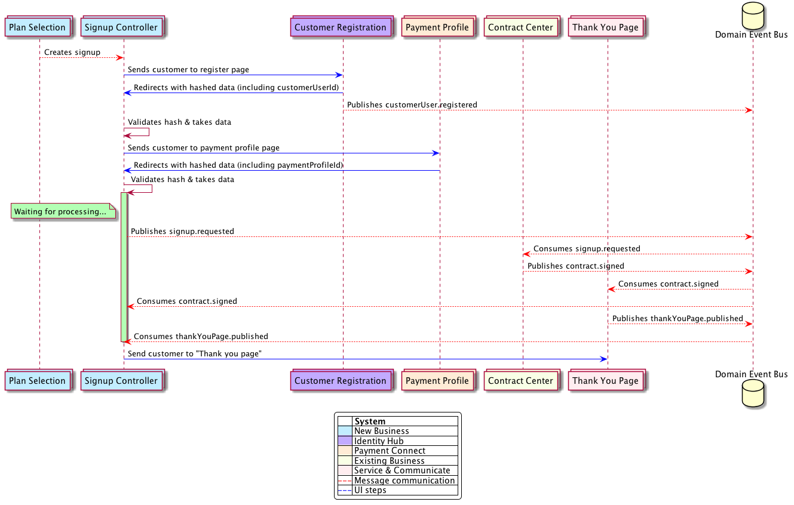

# System Communication Flow - 18.09.2017

This document shall describe the flow of a user and the data as of 22.08.2017. Note that this document might be changed or extended at any time and the signup outlined here is only valid for the given date.

## Customer perspective

1. Customer reaches plan selection page
2. Customer customer selects a plan
3. Customer is redirected to the customer user register page
4. Customer enters his data and submits
5. Customer is redirected to processing page
6. Customer is redirected to the payment profile page
7. Customer enters his data and submits
8. Customer is redirected to processing page
9. Customer is redirected to thank you page

## Data perspective

1. Signup entity is created when plan is selected
2. Link to customer user register page with signup ID and clientAccount ID and a hash (for security) in URL is generated and customer is sent to it
3. Customer will be returned via URL with signup ID, customer user ID and a hash (for security)
4. Hash is validated and signup entity is extended with customer user ID
5. Link to payment profile page with signup ID in URL is generated and customer is sent to it
6. Customer will be returned via URL with signup ID, payment profile ID and a hash (for security)
7. Hash is validated and signup entity is extended with payment profile
8. signup.requested is getting published to domain event bus. Note: For Reporting a signup.requested.tmp event is also sent which contains generated customer data. This will be removed in the future. 
9. Contract is created, contract signed is getting published
10. Thank you page is created based on contract and thankYouPage.published is published to domain event bus
11. New Business will collect both contract as well as thankYouPage to complete the signup
12. Customer will be sent to URL from thankYouPage.published event

## Next steps

- The next step will be to include the customer profile page in the flow which has already been created by Team Contractors
- A review page will also follow in the near future due to tax reasons

## Ownership of the flow

Many things may happen during such a signup flow, and therefore it is necessary to always not only have a look at the happy path but also at the unhappy path. What happens if one system takes longer to respond?

**Therefore it is crucial to make sure that only one system is responsible for the whole flow of what the customer sees. Only one system is the coordinator of things to happen in the view of a user.**

In this example, the owning system is New Business. Depending on the entry point this might of course change, e.g. existing customers upgrading their subscription will be guided by the Existing Business System.

##### This means that only the owning system...

- ... may decide what the flow of a user is (e.g. review page or not?)
- ... may decide where the user goes next
- ... should be responsible of handling processing timeouts and alike

##### This also means that any other system...

- ... must support redirect URLs when not the owner of a flow
- ... should only handle their own UI faults (data missing, page cannot be displayed and so on)

##### Open questions

- What happens if a single system in the flow is unable to present the page? How do we make sure to not get the user stuck?
- ...