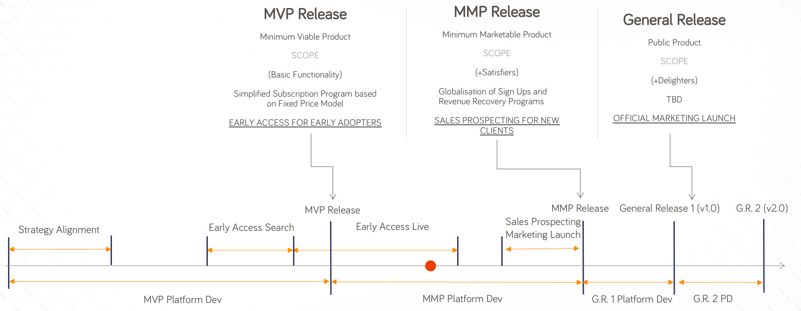
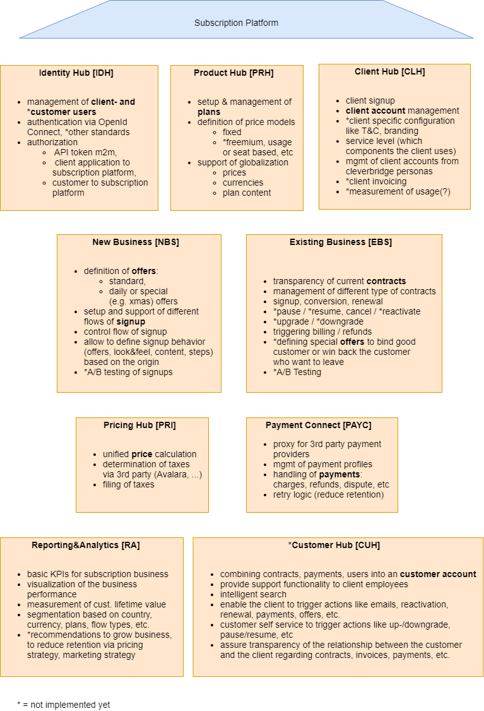
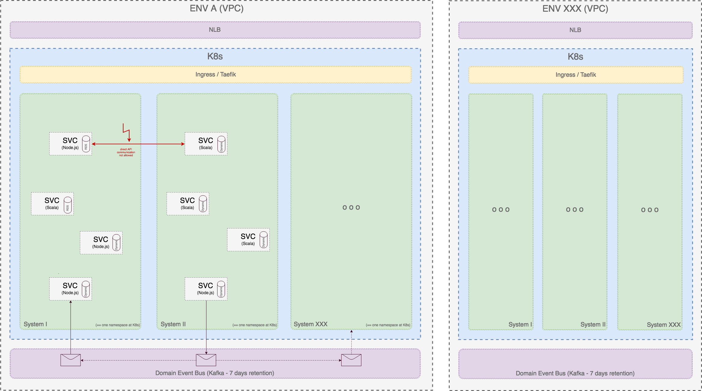
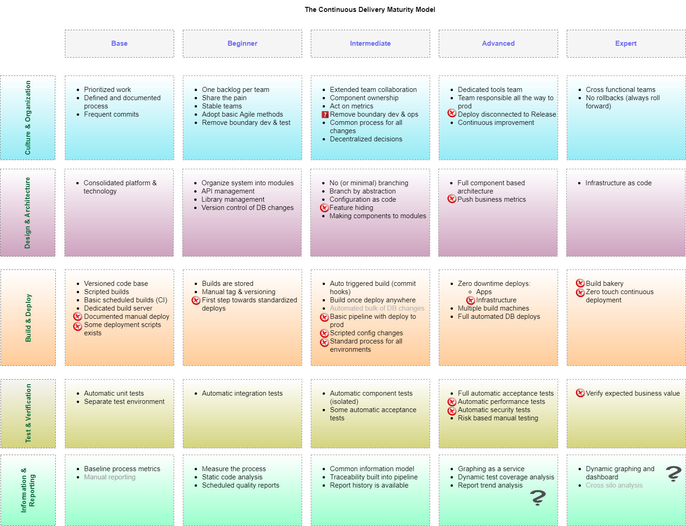
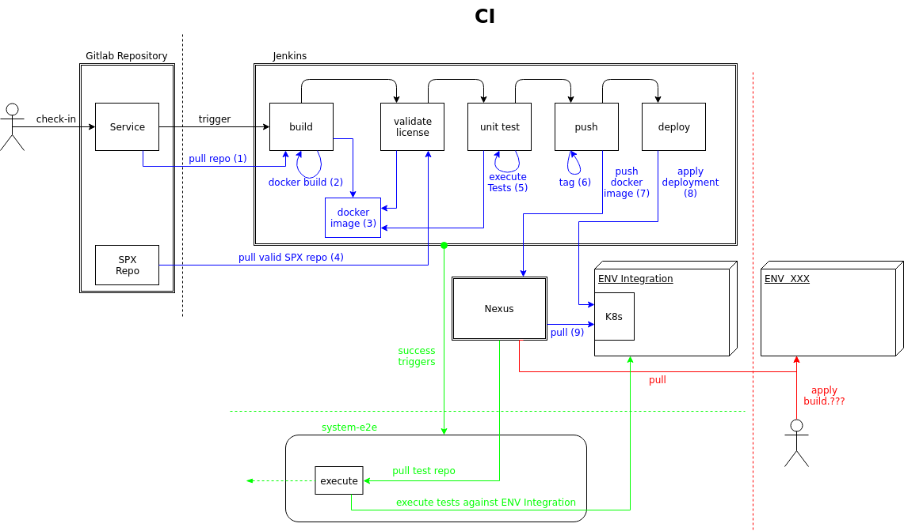
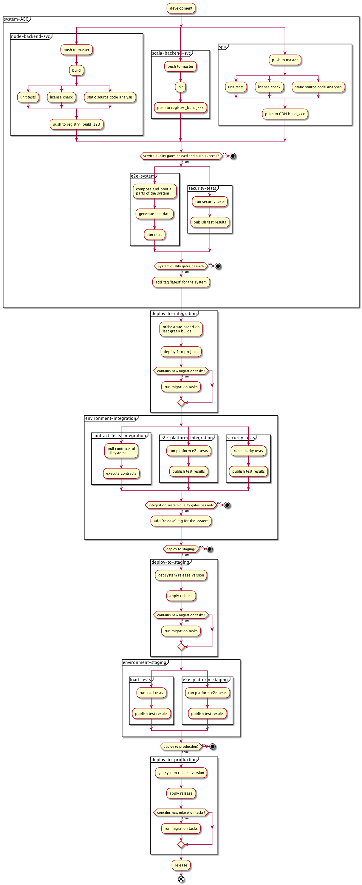
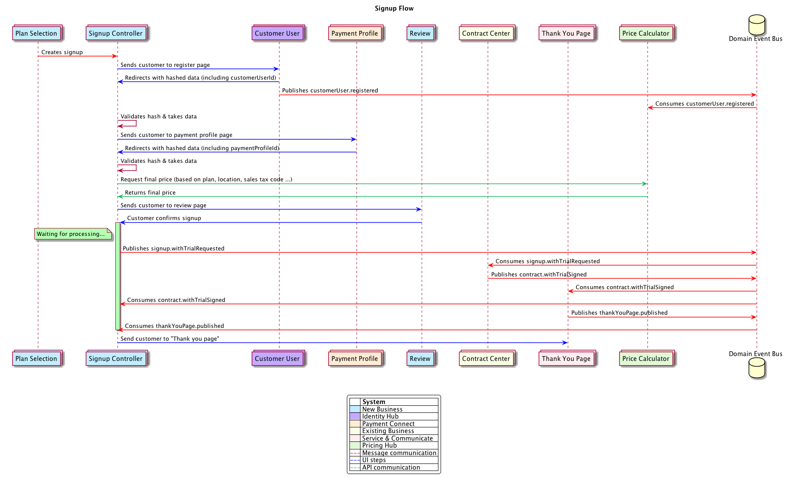

<!-- START doctoc generated TOC please keep comment here to allow auto update -->
<!-- DON'T EDIT THIS SECTION, INSTEAD RE-RUN doctoc TO UPDATE -->
# Table of Contents

- [Workshop ThoughtWorks](#workshop-thoughtworks)
    - [Motivation](#motivation)
        - [Product](#product)
        - [Organization](#organization)
    - [Verticals](#verticals)
    - [Macro Architecture](#macro-architecture)
        - [Blueprint of an Environment](#blueprint-of-an-environment)
        - [General Rules](#general-rules)
    - [Continuous Delivery](#continuous-delivery)
        - [Maturity Model](#maturity-model)
        - [Status Quo](#status-quo)
        - [Vision](#vision)
    - [API](#api)
        - [use cases](#use-cases)
    - [Micro Frontends](#micro-frontends)

<!-- END doctoc generated TOC please keep comment here to allow auto update -->

# Workshop ThoughtWorks

## Motivation

### Product

#### Vision

> Drive our clients to maximum success by winning, understanding, growing and retaining customers.
>
> The most flexible and complete solution to manage customer lifetime values for forward thinking subscription companies.
>
> We provide the tools and expertise to help clients drive customer loyalty to an optimum.

#### How to achive that Goals?

- Make the Complex Simple
- Go Global, Act Local
- Customer Centric
- Trusted Expert
- Maximize Customer Lifetime Value

#### Business Model

see linked image: [Business Model](./sources/business-model.png)

#### Release timeline

### Organization

#### Experience in the past

- cleverbridge has initiated several projects in the past to extend the business portfolio
- all of them were integrated into the existing cleverbridge e-commerce solution
- as the existing solution is a big monolith the intention was to extend it and further transfer the big ball of mud to a micro-service architecture step-by-step
- the first try ended up as just a layer on top (project "my-account")
- the second followed the approach API first and was beside but could not live without the existing (project "cloud")

#### Learnings

- it is hard to get feedback from the right person at the API first approach
- layered teams:
    - multiple teams need to have deep domain knowledge
    - domain knowledge you need to know gets very big in a complex business
    - prioritization is difficult to release features e2e which means coupling between teams at the end
    - scaling men power has limits
- it is difficult to onboard new employees at complex business requirements

#### next evolution

> The main goal is to enable business teams to deliver independently from others business features fast.

**How to achieve that?**

- the domain itself should drive our design (DDD)
- cutting the domain into several **[verticals](#verticals)** which derives technical architecture
- self-organized cross-functional teams, which...
    - are focusing on a dedicated part of the domain
    - are able to deliver features e2e
    - have the ownership for their domain to find the best solution fitting market needs
- PaaS team which serves business teams with infrastructure and platform services (CD, logging, metrics, ...)
- Owner Groups which have representatives from each team to consolidate and focus on dedicated aspects (architecture, quality, frontend, agile, product)

## Verticals

- [Identity Hub](../../architectural-outline/resources/systems/identity-hub_2018-07-05.png)
- [Client Hub](../../architectural-outline/resources/systems/client-hub_2018-07-10.png)
- [Product Hub](../../architectural-outline/resources/systems/product-hub_2018_07_09.png)
- [New Business](../../architectural-outline/resources/systems/new-business_2018_07_09.png)
- [Existing Business](../../architectural-outline/resources/systems/existing-business_2018_07_10.png)
- [Payment Connect](../../architectural-outline/resources/systems/payment-connect_2018_07_11.png)
- [Pricing Hub](../../architectural-outline/resources/systems/pricing-hub_2018_07_09.png)
- Customer Hub
- [Serve & Communicate](../../architectural-outline/resources/systems/serve-communicate_2018-07-05.png)
- [Reporting and Analytics](../../architectural-outline/resources/systems/reporting_2018-07-12.png)

## Macro Architecture

### Blueprint of an Environment

### General Rules

- Verticals and Teams should work as autonomously as possible
- Knowledge sharing is crucial

#### Programming Languages / Main Framework

- NodeJS
    - well established framework
    - huge community
    - many packages with out-of-the-box functionality

- Scala
    - akka framework (cluster, persistence, event sourcing, concurrency, data aggregation with Spark ...)

#### Frontend Framework

- React

#### Shared Code

- do not solve same problem again
- other teams profit from shared code
- principles
    - use packages
    - no business functionality
    - use semantic versioning
    - change and feature requests via merge requests (open source principle)
    - packages are owned by one development team

#### Databases

- AWS DynamoDB
- AWS RDS (MySQL)

#### Separation of verticals

Main architectural guideline:

> Every vertical should persist all the data it needs to perform its work.
> This implies synchronization and redundancy and eventual consistency,
> which is absolutely acceptable!

The guideline implies:

- Verticals communicate between each other only through Event Bus and Domain Events (**No** API calls!!!)
- Verticals integrate with UI
- No shortcuts between vertical borders

#### Stay asynchronous

- asynchronous communication between verticals for scalability and responsiveness
    > Never have synchronous (sub-)requests at the request-response cycle!
- decoupling through event sourcing

#### Domain Events

- object describing an event the domain cares about
- consumed only across bounded context (probably internal event otherwise)
- Never broadcast an event when there is no need
- No breaking changes
    - properties can not be deleted, renamed or alike
    - properties must remain optional as long as the presence of a value cannot be guaranteed

#### Event Bus

- Kafka

## Continuous Delivery

### Maturity Model

### Status Quo

### Vision

## API

- What is actually a common expectation of API consumers?
- What are possible solutions to provide simple and usable APIs for client developers, to create a signup flow which fulfills client business? (do not place to much logic to the client)
- How to design APIs for business flows crossing multiple verticals?

### use cases

- one pager
- multi pager
- session / state handling (abort and come back, failure handling)
- different signup types (with trial, without trial, only trial)
- different entry points (landing page, customer portal, ...)

## Micro Frontends

- In general pages should be completely delivered and owned by one vertical
- However in some cases pages should consist of content from multiple verticals (e.g. reporting charts, dashboards, one-pager signup)
- First approach with custom elements looks promising
