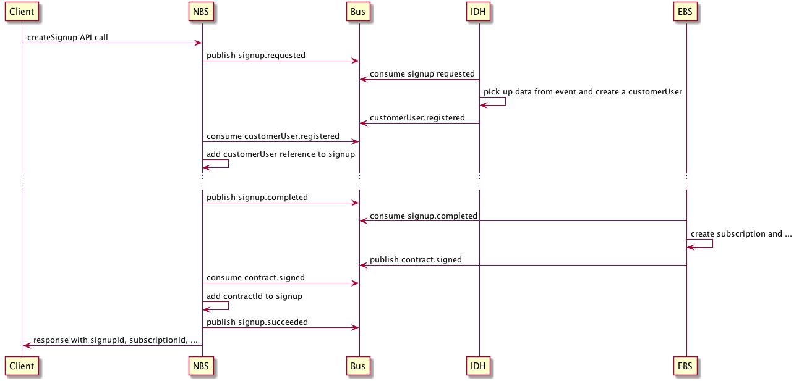

# Meeting Minutes

## Kafka Issue

Sieht aus, als haben wir zwei verschiedene Probleme:

### a) Netzwerk- / Kafka-Problem am Aug. 14, 2018 12:00:06 to Aug. 14, 2018 15:00:06 ??

**@Roland**

- Zeitraum:
- check logs vom Consumer (Anfang, mitten drin und Ende)
- check Scala Consumer config
- Wieviele Instanzen sind zur jeweiligen Zeit gelaufen? Haben alle oder nur bestimmte Probleme gehabt?

-> Gab es hier uU wirklich ein Netzwerkproblem?

> #### Analyse Scala Kafka Consumer Probleme am 14.08
>
> Am 14.08 gab es im Zeitraum 12:13-12:14 Uhr und 13:43-13:58 Uhr immer wieder Kafka reconnects im PAYC PaymentReader.
>
> ##### Scala Kafka Actor Consumer
> Wir haben in den Kafka Actor eine Logik eingebaut, fehlerhafte Events in der Datenbank zu persistieren und dann das Event an Kafka zu comitten, damit Kafka nicht geblockt wird.
> Bevor neue Events zu einem Contract/Payment... verarbeitet werden, wird auf alte fehlerhafte Events geprüft und ggf. das aktuelle Event persistiert.
> Das Defaultverhalten des Scala Kafka Actors ist im Falle von Zugriffsproblemen auf die Datenbank, sich selbst zu beenden und das Kafka Event nicht zu comitten. Der Kafka Actor wird dann zeitverzögert automatisch neu gestartet.
>
> ##### Zeitraum 12:13-12:14 Uhr
> In diesem Zeitraum hatten wir SQLTransientConnectionExceptions => es konnte keine Verbindung zur Datenbank hergestellt werden. Ergo konnte der Kafka Actor keinen Lookup auf alte fehlerhafte Events ausführen und hat sich dann selbst beendet.
>
> ##### Zeitraum 13:43-13:58 Uhr
> In diesem Zeitraum gab es Foreign Key Constraint Violations auf der Datenbank, die eigentlich nicht zum beobachteten Verhalten hätten führen dürfen. Die Stelle, die zum disconnect von Kafka führt enthält leider kein Logging, so dass ich nur vermuten kann, dass gleichzeitig ein schreibender Zugriff in die DB nicht möglich war und als Folge dessen sich der Kafka Actor selbst beendet hat.
>
> ##### Ergebnis
> - es gibt keine generelle Scala Kafka Consumer Problematik, die zu Consumer Lags führt
> - das beobachtete Verhalten im PAYC PaymentReader entspricht der Implementierung im Falle von Datenbankproblemen
> - das Logging für den Scala Kafka Actor muss erweitert werden, damit solche Problemsituationen sofort erkannt werden

### b) Node Consumer sind nicht selbstheilend

**@Pete**

- Consumer Leader/Follower election?

### next steps

- @Rolands Analyse abwarten
- @Pete: Logs anpassen (nur das Wesentliche), Leader/Follower election analysieren
- Consultant mit einbinden?

## Performance Initiative

- @Black: schauen im aktuellen Sprint gerade ob man auf einfache Art und Weise die `window.performance` Daten abgreifen kann
- @Krisztina: https://www.honeycomb.io evaluieren (see also https://www.honeycomb.io/blog/2017/11/instrumenting-browser-page-loads-at-honeycomb and/or  https://www.youtube.com/watch?v=ACHr-qwHS8Y)
- @Roland: https://ghostinspector.com evaluieren
- @Nico: Pingdom Tests erweitern

## API (Fortsetzung von Abstimmung mit POs)

> Annahme (in Abstimmung mit Oli): Der customerUser wird beim Client gespeichert / authentifiziert. Uns wird via API eine Referenz mitgeteilt

- die Art und Weise der Erfassung der Payment Daten trennen wir von der Lösungsvariante der angestrebten signup API
- => @Contractors: Lösungsvorschläge erarbeiten
- => createSignup API hat ein required field "payment Referenz"
- im Response wird direkt die subscriptionId zurückgegeben (d.h. auf alle Verabeitungen auf cb Seite wird gewartet) => eine mögliche Ausbaustufe könnte sein, dass der client einen Auftrag anlegt und dann immer wieder pollen kann um den Status zu erfahren
- die vor der Response einzusammelnden Dinge / abzuarbeitenden Dinge werden über den domain event bus geteilt (=> keine synchronen API calls von NBS aus)
- NBS ist owner der signup API (state manager)

### Aktueller Stand

### next steps

- auf die eine Lösungsvariante fokussieren
- error handling!?
- Was genau passiert konkret bei den einzelnen steps
- API Schema definieren

## nächstes Mal

- API
- ~@Nico: Termin für EY Auditierung - SOC2 (Workshop 25./26.09., Assessment Q1 2019)~
- @Krisztina: Security Scan mit Winni koordinieren
- der etwas größere Blick: Was brauchen wir noch um für das general Release gut aufgestellt zu sein?
- Ingress Resourcen "collision"
- Reviewprozess Domain Events
- Makro-Architektur one pager: https://github.com/Scout24/scout24-it-principles/blob/master/Scout24ITPrinciples.pdf
- PaaS
- FOG?
- QOG?
