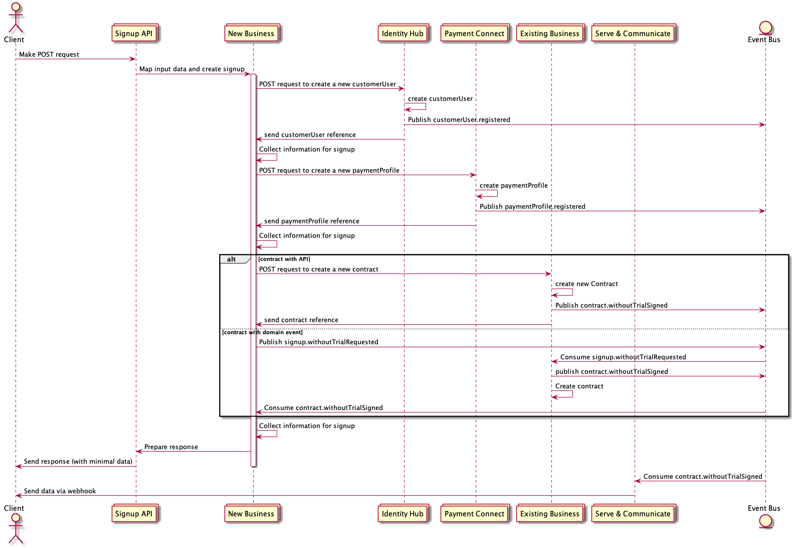

# Meeting Minutes

## Pentest (21.11. - 23.11., Nachbesprechung 24.11.)

> Informationen an Winni bis Mi 14.11.

- @Roland: PennTest auf early mit aktiviertem Stripe (+ Testaccount einrichten) @AOG: mit POs klären
- @Nico 3 User für für zwei verschiedene clientAccounts (Email Adressen kommen von Winni)
- @Pete: Avalara konfigurieren
- @AOG Winni genaue Ansprechpartner weiterleiten
- @Krisztina 
    - @PaaS: https://git.sub.rocks/paas/user-documentation/tree/master (gesamt extrahieren mit Filter auf technisch)
    - AWS Anmeldung für Pentest (21.11. - 23.11.)
- @Nico: "big Picture"
    - blue print
    - alle System-Schaubilder
- @Robin: IDH Doku? 
    - Verweis auf OpenidConnect
    - Verweis auf verwendete Packages und Frameworks
- https://help.subscription-platform.com/hc/en-us
- https://developer.subscription-platform.com/docs

## Security Scan Winni/Acunetix

### Findings

- Customization Editor interpretiert direkt bei der Eingabe JS => bekannt, als Bug bei Tema Black eingetragen
- Sendgrid/Emails: https://jira.cgn.cleverbridge.com/browse/SCO-540
- Report von Acunetix (Als PDF per Mail.):  
    - Total alerts found 7  
    - **High 0**  
    - Medium 3  
    - Low 3  
    - Informational 1  

> Winni hat gesagt: "Sehr gut"
 
### Tooling 
    
- Acunetix
    - funktioniert noch nicht gänzlich, Bugfix im November
    - auch Automatisierung möglich => Business Version wird von Winni für 2019 ins Budget genommen 

## signup API

> Ist es wirklich sinnvoll den Kommunikationsweg über den domain-event Bus zu wählen? => Challengen!

### Modellierung Kommunikationsfluss

### Vorteile API Ansatz

- direkter Response vom Supplier => mehr / bessere Möglichkeiten für Fehlerbehandlung
- keine Zweckentfremdung vom Domain-Event Bus
- isolierte Testbarkeit mittels fake APIs
- geringere Latenz

### Nachteile API Ansatz

- NBS muss mit etwaiger Nichtverfügbarkeit umgehen

### kein Unterschied

- das Interface, welches dem Client zur Verfügung gestellt wird, bleibt sowohl bei dem einen, als auch bei dem anderen Ansatz noch zu klären

### Fazit

- es gibt keine offensichtlichen Gründe, welche uns davon abhält den API Ansatz für den signup zu wählen

### Rahmenbedingungen

- Kommunikation via HTTP
- Schema vom Supplier definiert:
    - required fields
    - types
    - optional
    - additional erlaubt
    - examples
    - description
- Response 
    - success: HTTP 201 - body: Referenz ID (location header auf resource (sobald GET verfügbar))
    - failure: HTTP 4xx - body: Fehlercode, Message
- Supplier stellt fake API zur Verfügung und hält diese aktuell (eigenes Repo, Docker, welches man composen kann)
- perspektivisch werden die signup.* domain events nicht mehr publiziert

### Todo's

- Contractors: 
    - PAYC erneut Refinen
    - EBS (zuvor gedachte Nullaufwände) Refinen

## nächstes Mal

- EBS bereinigt Daten? Alle? Kompletter wipe?
- Wie sollen Test Clients erkannt werden, die durch TripleC Tests entstehen?
    - Testdaten migirieren
    - Testdaten erkennen
    - Testdaten löschen
- Events producen / consumen (siehe PaaS-AOG Abstimmung)
- Contractors UIs merge (mit Roland besprechen)
- Ingress Resourcen "collision"
- Makro-Architektur one pager: https://github.com/Scout24/scout24-it-principles/blob/master/Scout24ITPrinciples.pdf
- PaaS
- FOG?
- QOG?
