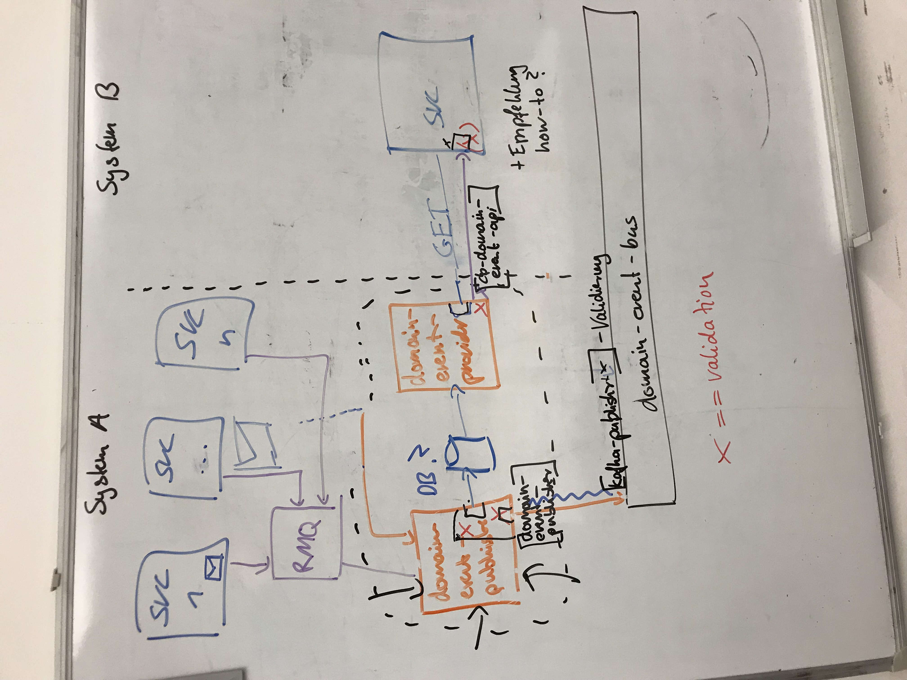

# Meeting Minutes

## Event Resync
   
### unterschiedliche Szenarien (neues Feld, altes Feld weg, ...) darstellen und konkret das Vorgehen beschreiben

#### Aspekte die zu betrachten sind

- a) Wie muss das domain-event Scheme angepasst werden?
- b) Was muss der Producer tun?
- c) Was muss der Consumer tun?
- d) Wie wirkt sich diese Änderung auf den Rollout aus?
- e) Was muss der Consumer beim re-sync beachten?
 
#### neues optionales Feld kommt hinzu

- a) Schema wird erweitert, domain-event bleib in gleicher major version (minor)
- b) sobald Feld verfügbar, einfach mitschicken
- c) zunächst nichts; sofern Feld verwendet wird, muss dies auch als optional betrachtet werden
- d) vollkommen unabhängig
- e) siehe c)
 
#### neues required Feld kommt hinzu 

- a) neue major Version, oder durchaus auch anderes Event (weiteres geht von major aus)
- b) in einer Übergangsphase sowohl das alte als auch das neue Event schicken (beide versionen); altes Event bleibt wie gehabt
- c) auf das neue major migrieren
- d) C kann erst nach P migrieren
- e) 
    - C muss mit beiden Versionen umgehen können und entsprechende Business Definitionen berücksichtigen
    - P stellt sicher, dass in dem Zeitraum wo gleichzeitig >1 Version von einem Event supportet wird, diese mit der correlationId gruppiert werden

#### optionales Feld entfällt

- a) Schema wird entsprechend angepasst, minor Version
- b) Feld nicht mehr mitschicken
- c) Nichts, ggf. Nutzung des Feldes komplett entfernen (hängt vom Business-Case und der Aufrechterhaltung der Abwärtskompatibilität ab)
- d) keine Abhängigkeiten
- e) siehe c)

#### required Feld entfällt (hoher Orga Aufwand!!!)

- a) neue major Version, oder durchaus auch anderes Event (weiteres geht von major aus)
- b) 
    - für eine Übergangsphase beide Versionen publishen (in der ursprünglichen Version muss diese Information nocht enthalten sein)
    - erst wenn alle Consumer auf die neue Version umgestellt haben, muss die alte Version nicht mehr geschickt werden
    - erst danach kann die Business-Logik dahingehend angepasst werden, dass die entfallende Information nicht mehr erfasst wird
- c) auf die neue Version migrieren; Business-Logik anpassen und handeln das diese Information entfällt
- d) P: neues Event schicken; C: umstellen auf neue Version; P: alte Version nicht mehr schicken; P: Erfassung / Business-Logik anpassen
- e) C muss mit alter und neuer Version umgehen können und individuell entscheiden wie er damit umgeht

#### Feld wird optional

> siehe required Feld entfällt

#### Feld wird required

- a) neue major Version, oder durchaus auch ein anderes Event (da sonst re-sync Validierung nicht möglich)
- b) für eine Übergangsphase beide Versionen publishen
- c) Schema upgraden; uU muss aber nichts an der Business-Logik anpassen 
- d) C nach P, sonst keine Abhängigkeiten
- e) C muss mit alter und neuer Version umgehen können und individuell entscheiden wie er damit umgeht

#### Datentyp | pattern von Feld ändert sich

> Sofern sich Datentyp für ein Feld ändert, so gibt es zwei Möglichkeiten: a) neues Feld daneben legen oder b) neue Version vom Event. Jeweiliges Handling, siehe oben.
>
> Beispiel a): paymentProfileId => paymentProfileIds[]
> Beispiel b): state(US-AL)     => state(AL)

### Format von gespeicherten domain-events

    {
        from:
        to:
        ...
        items: [
            {
                correlationId:
                v1: { domainEvent }
            },        
            {
                correlationId:
                v1: { domainEvent },
                v2: { domainEvent }
            },        
            {
                correlationId:
                v2: { domainEvent }
            },        
        ]
    }

### Grafik erstellen, welches das resyncen veranschaulicht
   
> TODO: digitalisieren

#### Notes

- cb-domain-event-api => cb-domain-event-provider
    - consumer entfernen
    - über config an domain-event store binden
    - Interface direkt im package implementieren
    - (könnte uU auch ohne package, sondern direkt als nutzbarer service gebaut werden)
    - + ggf. Option auch invalide domain-events zu verschicken
- cb-domain-event-publisher
    - validiert domain-events (see kafka-publisher package)
    - publiziert auf kafka
    - persistiert domain-event in DB
    - config
        - mapping zu topics
        - mapping zu DB / Tabellen / ...
- kafka-publisher => DEPRECATED
- Validierung im domain-event-publisher, domain-event-provider und am (Consumer)
- Was ist bei der Einführung zu beachten? => store von beginn befüllen (Migration)
   
### offene Todos   
   
- @Nico: Outline aktualisieren
- @Nico: Grafik erstellen
- @Nico: DB research
- Einpreisen forcieren, sodass jede Entität künftig das resyncen ermöglicht

## nächstes Mal

- resync von domain-events (kurz weiteren Plan besprechen)
- Erkenntnise von Krisztina meetup HH
- domain-events - Orga von Files im Package bei Versionierung
- Wie sollen Test Clients erkannt werden, die durch TripleC Tests entstehen?
    - Testdaten migirieren
    - Testdaten erkennen
    - Testdaten löschen
- Ingress Resourcen "collision"
- Makro-Architektur one pager: https://github.com/Scout24/scout24-it-principles/blob/master/Scout24ITPrinciples.pdf
- PaaS
- FOG?
- QOG?
- Tech-Review
