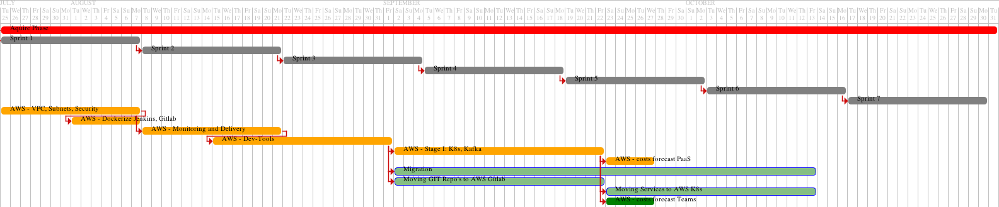

# Road to AWS

All stages will be hosted at Amazon AWS. The PaaS team works actually hard to get the first part of the infrastructural components running.

See an overview timeline to get prepared for the migration (it will be updated frequently):

----

Notes / hints:

- @PaaS: create a short migration guideline
    - How to move Repositories from cb to AWS?
    - How things change in use?
    - ...
- im neuen Gitlab public SSH Key hinterlegen
- business teams need to move their projects by themselves
    - it is neccessary to set the public at new Gitlab in AWS (as is currently at cb Gitlab as well)
    - packages need to get moved first
- [AWS cleverbridge VPC](https://sharepoint.cgn.cleverbridge.com/Development/Public_DocumentLibrary/PaaS%20Team/AWS%20Cloud/cleverbridgeVPC.pdf)